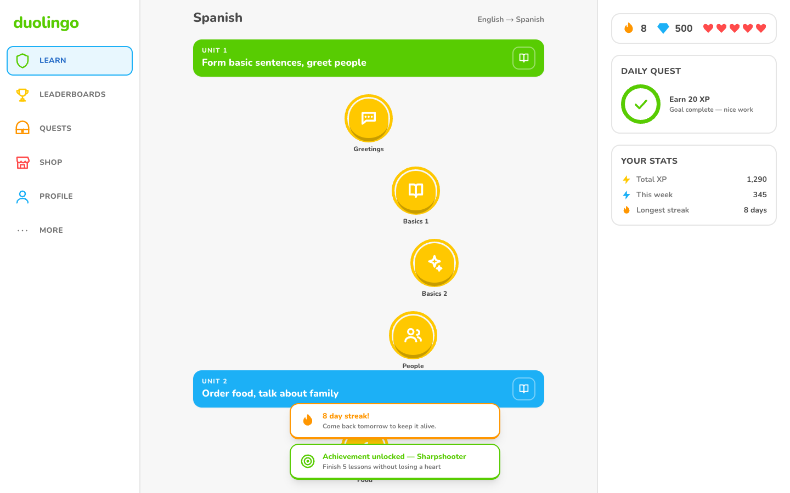
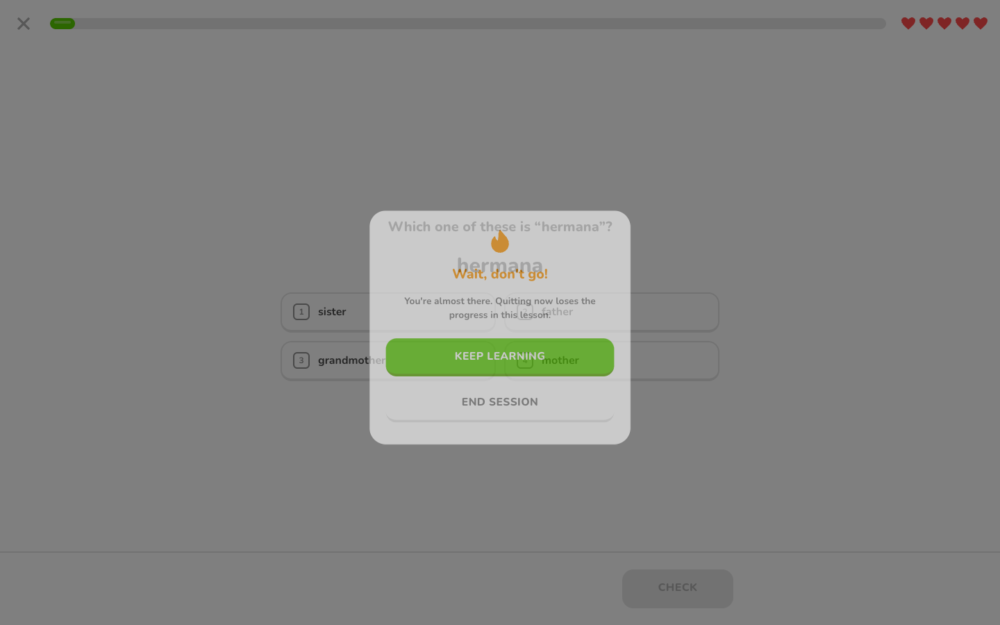

# Duolingo Clone

A working Duolingo clone: a winding skill path, a full-screen lesson player with
five exercise types, and server-authoritative hearts, XP, streaks and crowns.

**Stack:** FastAPI + SQLAlchemy 2.0 + Alembic + SQLite (dev/test) / Postgres
(production — see Deployment) · Next.js 15 App Router +
TypeScript (strict) + Tailwind + Zustand + framer-motion.

The guiding principle throughout: **the client renders, the server decides.** No
answer key, XP formula, heart rule or unlock condition exists in the browser.

---

## Screenshots

| Learn path | Lesson player | Completion |
|---|---|---|
|  |  |  |

| Profile | Leaderboard | Dark mode |
|---|---|---|
|  |  |  |

| Feedback bar | Match pairs | Mobile (375px) |
|---|---|---|
|  |  |  |

| Streak & achievement toasts | Out of hearts / quit |
|---|---|
|  |  |

Captured from the running app with Playwright at 1440x900 (and 375x780 for
mobile), not mocked.

---

## Quick start

Two terminals, or one `docker compose up --build`.

### Backend

```bash
cd backend
python3 -m venv .venv && source .venv/bin/activate
pip install -r requirements.txt
cp .env.example .env

alembic upgrade head            # create the schema
python -m app.seed.seed_data    # load the course and demo learners (idempotent)
uvicorn app.main:app --reload   # http://127.0.0.1:8000  (docs at /docs)
```

### Frontend

```bash
cd frontend
npm install
cp .env.example .env.local      # NEXT_PUBLIC_API_URL=http://127.0.0.1:8000
npm run dev                     # http://localhost:3000
```

### Docker

```bash
docker compose up --build       # frontend :3000, backend :8000, seeded on boot
```

### Tests

```bash
cd backend  && python -m pytest -q                  # 129 tests, no network or clock needed
cd frontend && npm run typecheck && npm run lint
```

**End-to-end (Playwright).** These drive the real UI against a real backend --
nothing is stubbed, because the behaviour worth protecting (a heart is spent, a
locked skill refuses to open, a dropped connection is reported) is decided by the
server. Needs both processes up, the backend with the demo clock on (`DEBUG=true`, the default):

```bash
cd frontend
npx playwright install chromium   # first run only
npm run test:e2e                  # 10 specs
```

The suite spends hearts deliberately, so it tops the learner back up between
specs by advancing the app's own simulated clock -- the same mechanism heart
regeneration uses -- rather than writing to the database behind the app's back.

---

## Environment variables

| Service | Variable | Default | Purpose |
|---|---|---|---|
| backend | `DEBUG` | `true` | General debug flag. Used as the fallback for `ENABLE_DEMO_CLOCK`. |
| backend | `ENABLE_DEMO_CLOCK` | *(follows `DEBUG`)* | Mounts the `/api/v1/dev/*` day-simulation routes. Off means they do not exist at all. The simulated clock is personal to whichever learner's `user_id` is named in the request (persisted on their own `user_stats` row) — advancing it never moves another learner's date. |
| backend | `DATABASE_URL` | `sqlite:///./duolingo.db` | Any SQLAlchemy URL; Postgres works unchanged. |
| backend | `CORS_ORIGINS` | `http://localhost:3000,...` | Comma-separated browser origins. |
| frontend | `NEXT_PUBLIC_API_URL` | `http://127.0.0.1:8000` | Backend base URL. **No localhost is hardcoded in the source.** |

---

## Repository layout

```
backend/
  app/
    core/        config, engine/session, and the simulated clock
    models/      SQLAlchemy tables (the schema below)
    schemas/     Pydantic request/response shapes -- the API contract
    routers/     thin HTTP adapters; no business rules live here
    services/    the rules: grading, hearts/XP/streaks, path unlocking
    seed/        course content + the idempotent seeder
  alembic/       migrations
  tests/         129 tests, in-memory SQLite

frontend/
  src/
    app/         App Router routes (path, lesson, profile, leaderboard, ...)
    components/  exercises/, lesson/, path/, layout/, ui/, stats/, profile/
    store/       Zustand stores (session, lesson run, toasts, theme)
    lib/         the API client, answer building, formatting, icons
    types/       the API types the client and server agree on
  e2e/           Playwright specs driven against a real backend
```

Two rules keep this honest: **routers contain no rules** (they call services and
serialise the result), and **`lib/api.ts` is the only module that touches the
network**, so the base URL, error shape and failure translation are decided once.

---

## Architecture

```
                    Browser
                       │
   ┌───────────────────┴────────────────────┐
   │  Next.js 15 App Router (frontend/)     │
   │                                        │
   │  app/          routes & pages          │
   │  components/   path · lesson ·         │
   │                exercises · ui · layout │
   │  store/        zustand (session,       │
   │                lesson, theme)          │
   │  lib/api.ts    the ONLY fetch caller   │
   │  types/api.ts  mirrors of the schemas  │
   └───────────────────┬────────────────────┘
                       │  REST /api/v1  (JSON)
   ┌───────────────────┴────────────────────┐
   │  FastAPI (backend/)                    │
   │                                        │
   │  routers/    HTTP only — no logic      │
   │      ↓                                 │
   │  services/   every rule lives here     │
   │      lesson_service      attempts      │
   │      gamification_service hearts/XP/   │
   │                           streaks      │
   │      answer_grader       pure grading  │
   │      path_service        unlock states │
   │      achievement_service badges        │
   │      ↓                                 │
   │  models/     SQLAlchemy 2.0 ORM        │
   │      ↓                                 │
   │  SQLite dev / Postgres prod (Alembic)  │
   └────────────────────────────────────────┘
```

**The layering rule:** a router may not contain an `if`. It resolves the request,
calls one service, and shapes the result into a Pydantic model. Services raise
domain errors (`NotFoundError`, `SkillLockedError`, `OutOfHeartsError`,
`ConflictError`); a single handler in `main.py` maps each to a status code. That
is the only place status-code policy exists.

---

## Database schema


**Design notes**

- `UNIQUE(parent_id, order_index)` on every content table: two siblings can never
  occupy the same slot on the path.
- Every FK is `ON DELETE CASCADE`, and SQLite's `foreign_keys` pragma is enabled
  per connection in `core/database.py` — without it those cascades silently do
  nothing.
- `user_stats.user_id` is both PK and FK: exactly one stats row per learner,
  enforced by the schema rather than by application code.
- `daily_xp` is the source of truth for streaks; `user_stats.current_streak` is a
  refreshed cache. See the trade-offs section.
- `achievements.metric` makes badge unlocking a data-driven loop instead of an
  `if/elif` over badge codes.

---

## API

All routes are under `/api/v1`. Every response is a Pydantic model; interactive
docs at `/docs`.

| Method | Path | Purpose |
|---|---|---|
| `GET` | `/course/path?user_id=` | Units → skills with per-skill `state` (`locked \| available \| in_progress \| completed`) and crowns, **computed server-side**. |
| `GET` | `/course/skills/{skill_id}/lessons` | Ordered lesson ids, so tapping a node can jump to the next unplayed lesson without downloading every lesson. |
| `GET` | `/lessons/{lesson_id}` | Exercises **without** `correct_answer` or `explanation`. |
| `POST` | `/lessons/{lesson_id}/start` | Opens an attempt. 403 if the skill is locked or hearts are empty. |
| `POST` | `/attempts/{attempt_id}/answer` | Grades one answer server-side → `{is_correct, correct_answer, explanation, hearts_remaining, attempt_failed}`. |
| `POST` | `/attempts/{attempt_id}/match-pair` | Verifies **one** match-pairs link so the board can flash green/red. Costs no heart. |
| `POST` | `/attempts/{attempt_id}/complete` | Awards XP, crowns, streak, unlocks, achievements; returns the completion summary. |
| `GET` | `/users/by-username/{username}` | Bootstraps the demo learner without a hardcoded id. |
| `POST` | `/users` | Creates a new learner (`username`, `display_name`) — what "Add a new learner" calls. 409 on a taken username. |
| `GET` | `/users/{id}/stats` | Hearts (after lazy regen), streak, gems, today's XP, weekly XP. |
| `GET` | `/users/{id}/profile` | Identity, stats, crowns, badges, 14 days of ledger. |
| `POST` | `/users/{id}/hearts/refill` | Spends 350 gems for a full bar. 409 if full or short. |
| `GET` | `/leaderboard?limit=` | Ranked on the last 7 days of `daily_xp` (real time — one shared week for every learner, see below). |
| `POST` | `/dev/advance-day` | **Demo clock only.** Moves the named `user_id`'s own simulated clock so streak behaviour is provable in seconds — no other learner's clock moves. |
| `POST` | `/dev/reset-clock` | **Demo clock only.** Returns the named `user_id` to real time. |
| `GET` | `/health` | Liveness probe. |

Errors come back in two shapes, and the client handles both:

- **Domain refusals** (403/404/409) — `{"detail": "Finish the previous skill…",
  "error": "SkillLockedError"}`. The `error` field is a stable code the UI
  branches on, which is how an out-of-hearts refusal reaches its own screen
  rather than a generic error notice.
- **Request validation** (422, FastAPI's own) — `detail` is an **array** of
  per-field objects. `lib/api.ts` flattens these to `"field: reason"` so a
  learner never sees a raw object.

---

## Gamification rules

All enforced server-side, all unit-tested.

| Rule | Behaviour |
|---|---|
| **Hearts** | Max 5. One lost per wrong answer. At 0 the lesson fails and the out-of-hearts modal appears. |
| **Regeneration** | 1 heart per 30 minutes, computed lazily from `hearts_updated_at` on read. A partially-elapsed interval is banked, not discarded. |
| **XP** | `lesson.xp_reward` (10) + 5 if no hearts were lost + 2 per remaining heart. A flawless run on a full bar pays 25. |
| **Streak** | Derived from `daily_xp`: consecutive days ending today *or yesterday*. Unchanged on a second lesson the same day. Resets when a full day passes with no row. |
| **Crowns** | One per *distinct* lesson completed in a skill. Replaying pays XP but not a second crown. |
| **Unlocking** | A skill opens once the previous skill on the path has its `required_crowns_to_unlock`. |
| **Daily goal** | 20 XP by default; the ring fills from today's ledger row. |
| **Gems** | Mocked currency. 350 buys a full heart bar. |

**Proving the streak rule in the interview:** open Settings → *Advance one day*.
The streak survives one quiet day (the run still ends "yesterday") and collapses
to 0 on the second. Nothing was incremented or decremented — the same
`compute_streak` function simply saw a different `today`.

---

## Seed data

`python -m app.seed.seed_data` — idempotent, safe to re-run.

- 1 course (English → Spanish), **3 units, 12 skills, 29 lessons, 261 exercises**
  using all five exercise types with real Spanish vocabulary.
- Demo learner **`prince`**: Unit 1 complete, mid Unit 2, **1,240 XP**, a **7-day
  streak**, 5 hearts, 500 gems, 14 days of `daily_xp` history summing to exactly
  1,240.
- 9 other learners so the leaderboard has a real field (`prince` places 5th).
- 6 achievements, **3 unlocked** — and unlocked *by the sync service reading the
  seeded state*, not hardcoded.

Content lives in three separate modules: `seed/content.py` (vocabulary and
sentences, pure data), `seed/exercise_factory.py` (deterministic generation of
the five shapes), `seed/seed_data.py` (idempotent upsert). A content edit cannot
break the seeding logic.

---

## Deployment

**One URL for the whole app:** https://duolingo-clone-frontend-tg3r.onrender.com

There is no separate backend link to hand out. `next.config.mjs` proxies
`/api/v1/*` to the backend server-side, inside Next's own Node process, so
every request the browser makes — page loads and API calls alike — goes to
that one domain. The backend still runs as its own Render service
(https://duolingo-clone-backend-w886.onrender.com), reachable directly for
grading or manual API testing, but the deployed *product* is one link.

| Service | Role | Notes |
|---|---|---|
| Frontend (Next.js) | The URL above | Free web service, Node runtime, proxies `/api/v1/*` to the backend |
| Backend (FastAPI) | Proxied, also directly reachable | Free web service, Python 3.13.5, migrates + seeds (`--if-empty`) on every start |
| Database | Not public | Render Postgres 16 (free) — see below, **not SQLite in production** |

**The production database is PostgreSQL, not SQLite**, even though SQLite is
the default everywhere else (local dev, CI, the test suite). The assignment
brief names SQLite; this deployment's database choice is a deliberate,
disclosed exception, made for one concrete operational reason: **Render's free
web services have no persistent disk** — a redeploy wipes the container
filesystem, and SQLite is a file. Free Postgres is a genuinely separate,
persistent resource with the same free-tier cost. The schema, models and
Alembic migrations are dialect-agnostic (verified against a real local
Postgres instance during development, alongside SQLite) — nothing in the
application code changed to support this, only the deployed `DATABASE_URL`.

One real bug this surfaced that SQLite's leniency had hidden: the leaderboard
query grouped by `User.id` while selecting whole `User`/`UserStats` rows.
SQLite allows that (it picks an arbitrary row for the ungrouped columns);
Postgres correctly rejects it. Fixed by pre-aggregating weekly XP in a
subquery instead of grouping the outer query at all — see the git history for
`app/routers/leaderboard.py`. It is why this README recommends testing
against Postgres at least once before trusting any query that groups or joins,
not only at the end.

**Re-checked deliberately, not assumed:** it would have been easy to also
blame SQLite for the concurrency requirement (duplicate/concurrent lesson
completion) and use that as a second reason to keep Postgres. That turned out
not to hold up: fired 8 real concurrent `POST /attempts/{id}/complete`
requests at a locally running SQLite-backed instance (genuine threads over
HTTP, not the test client) and got exactly one 200, seven clean 409s, zero
`database is locked` errors, and XP awarded exactly once — Python's `sqlite3`
module waits up to 5 seconds for a lock by default, which is far longer than
the single-row conditional `UPDATE` this app's duplicate-completion guard
needs to release one. So SQLite *can* safely handle this app's concurrency;
**persistence, not concurrency, is the actual and only reason production
uses Postgres.** Reporting a database as unsafe for a reason that does not
hold up under test would be exactly the kind of unverified claim this project
tries not to make.

One more free-tier fact worth knowing before it surprises anyone: **Render's
free Postgres databases expire and are deleted 30 days after creation**
(visible on the database in the Render dashboard). This is a platform limit
on the free plan, not something this project's configuration controls. If the
database has expired by the time this is reviewed, `render postgres create`
plus updating `DATABASE_URL` recreates it in a couple of minutes — the schema
comes back via `alembic upgrade head` and the seed guard (`--if-empty`) on the
next deploy; only demo data is lost, exactly as it would be on the very first
deploy.

**Python version is pinned** (`backend/.python-version`, and `PYTHON_VERSION`
in the blueprint): Render's default runtime for new services is a very recent
CPython for which `pydantic-core` has no prebuilt wheel, and Render's build
sandbox cannot compile it from source (its Rust/Cargo cache directory is
read-only there). Pinned to 3.13.5, the exact interpreter this project's tests
run against.

**Setting this up from scratch:** `render.yaml` declares both services and the
database and is kept accurate and `render blueprints validate`-clean, but the
actual deployment here was built with `render services create` /
`render postgres create` (one Render CLI call per resource, every env var set
in the same call) rather than a dashboard blueprint apply — the CLI's
blueprint support only validates a YAML file, it does not create resources
from it. There is one real ordering constraint: the frontend's `BACKEND_URL`
needs the backend's actual assigned hostname, which Render decides only once
that service's *first* deploy starts and does not let you know in advance.
Deploy the backend first, read its real URL, then deploy the frontend with
`BACKEND_URL` set to it. `NEXT_PUBLIC_API_URL` is deliberately **not set** on
the frontend at all — see `lib/api.ts` and `next.config.mjs` for why leaving
it unset is what makes the single-URL proxy work.

The demo learner's progress lives in that Postgres instance and persists
across deploys and cold starts. **A free instance sleeps after 15 minutes of
inactivity**, and the `--if-empty` seed guard is exactly what keeps a wake-up
from resetting it — but disclosed honestly, the wake-up itself was observed
taking as long as **~3 minutes** on a cold backend (not the 30–60s a Render
free tier often manages), which shows up as a slow or briefly-502ing first
request if the proxy's own request to the backend times out mid-wake. It
recovers on its own; reloading after a few seconds is normal, not a bug.
There is no code fix for this — free compute that sleeps is the platform's
tradeoff, not this app's. A paid Render plan (always-on) or an external
uptime ping every 10–14 minutes would both remove it; neither was set up
here, since both cost either money or an external dependency beyond this
assignment's scope.

---

## Assumptions & trade-offs

Things I decided rather than asked about, and what I traded away.

1. **No authentication.** The assignment is about the learning experience, so
   the "session" is a demo learner resolved by username at boot. Every
   endpoint takes an explicit `user_id`. Adding real auth means a dependency
   that resolves the caller and replaces that parameter — the service layer
   never changes, because no service reads a request. Profile's "Switch
   learner" is the honest shape a no-auth demo's account switching takes:
   it swaps which of the ten seeded learners is loaded (and remembers the
   choice), rather than a fake "log out" that would pretend to end a session
   that was never started.

2. **`daily_xp` ledger instead of a streak counter.** A counter is a number
   nobody can audit: if a bug double-increments it, the damage is permanent and
   invisible. A ledger of days is *evidence* — the streak is recomputed from it
   on every write, a support fix is inserting a row, and the `/dev/advance-day`
   demo works precisely because nothing is stored that could disagree.
   The cost is one extra row per active day per learner and a small recompute on
   completion. `user_stats.current_streak` caches the answer for cheap reads.

3. **Lazy heart regeneration instead of a scheduler.** Storing
   `hearts_updated_at` and deriving hearts on read means no cron, no job queue,
   and correct behaviour after downtime. The trade-off is that hearts only
   "arrive" when someone looks — which is fine, because nothing observes them
   except the learner.

4. **JSON `payload` / `correct_answer` columns.** The five exercise types have
   genuinely different shapes. The alternatives were five sparse tables (joins
   on every lesson fetch) or one wide mostly-NULL table. JSON keeps a lesson a
   single indexed query, and adding a sixth type is a content change plus one
   grader function rather than a migration. What I give up is database-level
   validation of the payload — mitigated by the grader owning every read of it
   and by tests over real generated content.

5. **Skill state is derived, never stored.** Storing `state` would be a second
   source of truth that can drift from the crowns that produced it. `is_unlocked`
   *is* persisted, but only as a denormalised convenience for the lesson-start
   guard; `path_service.build_path` remains the authority and rewrites it.

6. **Unlocking is linear across the whole course**, not per-unit. The spec says
   "the previous skill in the unit"; at a unit boundary that leaves the first
   skill of every unit unlocked from day one. Since the UI draws one continuous
   trail, "the previous skill" is read as the previous skill *on the path*,
   which is the last skill of the previous unit at a boundary. Within a unit the
   behaviour is identical to the spec.

7. **Match-pairs added an endpoint.** The board needs feedback per link, but the
   client must not hold the mapping. `/attempts/{id}/match-pair` answers one
   yes/no per tap — exactly the bit the game reveals anyway — and costs no
   heart, since a board can only be finished by matching everything. This
   matches the real game, where a mis-tap on this exercise is not punished.

8. **Repositories were left out.** The brief allowed "`repositories/` **or** ORM
   models". With five services and no second data source, a repository layer
   would be a pass-through that adds a file per aggregate and hides the query.
   Services use the ORM directly and keep their queries visible.

9. **The simulated clock is per-learner and persisted, not process-global.**
   Each learner's offset from real time lives on their own `user_stats.clock_offset_seconds`
   column, not a module-level variable — advancing one learner's day never
   moves another's, a restart never undoes it, and `/dev/reset-clock` drops
   only the named learner back to real time. (An earlier version of this kept
   the offset in process memory, shared by every visitor; fixed for exactly
   that reason.) The router is still not mounted at all when the demo clock is
   disabled.

10. **Wrong answers are not re-queued.** The real app re-inserts a failed
    exercise later in the lesson. Not implemented; every exercise is asked once,
    which keeps `exercises_answered` and the accuracy figure exact.

11. **Explicitly mocked, and labelled as such in the UI:** the guidebook button
    (disabled, not just styled to look inert), streak freeze, unlimited hearts
    in the shop, and every course but Spanish in the home page's language
    picker ("Coming soon"). Each says plainly that it is not part of the
    build rather than pretending to work. Everything else on screen is real:
    the quests page, including the two weekly quests, reads `weekly_xp`
    (summed from the last seven ledger days) and the streak; the speaker
    button on a lesson genuinely speaks the Spanish phrase aloud via the
    browser's Web Speech API — no progress bar or control on this build is
    decorative. The button shows its own state rather than being fire-and-
    forget: a pulsing icon while the browser is actually talking, and an
    honest "Audio isn't available in this browser" note (not a silently dead
    button) if the browser has no speech synthesis at all or its engine
    errors out. Coverage depends on the browser/OS having a voice installed
    for the target language — real everywhere tested, not universal.

---

## Scaling notes

See `WALKTHROUGH.md` for the full answer. In short: SQLite → Postgres is a URL
change; the path endpoint is already 3 queries regardless of course size; the
leaderboard is the first thing that breaks at scale (a full table scan of
`daily_xp` per request) and would move to a periodically-materialised league
table; `user_stats` is the only hot row per learner, and every write to it is
idempotent enough to sit behind a queue.

---

## Original work

Every line here is written for this assignment. The domain model, the derived
skill-state rule, the ledger-backed streak, the lazy heart regeneration, the
grader dispatch and the entire component tree are original; no Duolingo clone
repository was copied or adapted, and no Duolingo source code or proprietary
asset is included.

The visual language deliberately *evokes* Duolingo -- the winding path, the
rounded tiles with their 4px bottom border, the green/red feedback bar, the
crowned nodes -- because the brief asks for that experience. It is reproduced
from observation, in original CSS and original SVG paths (`lib/icon-paths.ts`).
The wordmark is not a logo file: it is the word set as text in Nunito, which
`next/font` self-hosts from Google Fonts under the SIL Open Font License.

This is a learning exercise, not a product. "Duolingo" is a trademark of
Duolingo, Inc., which has no association with this project.
