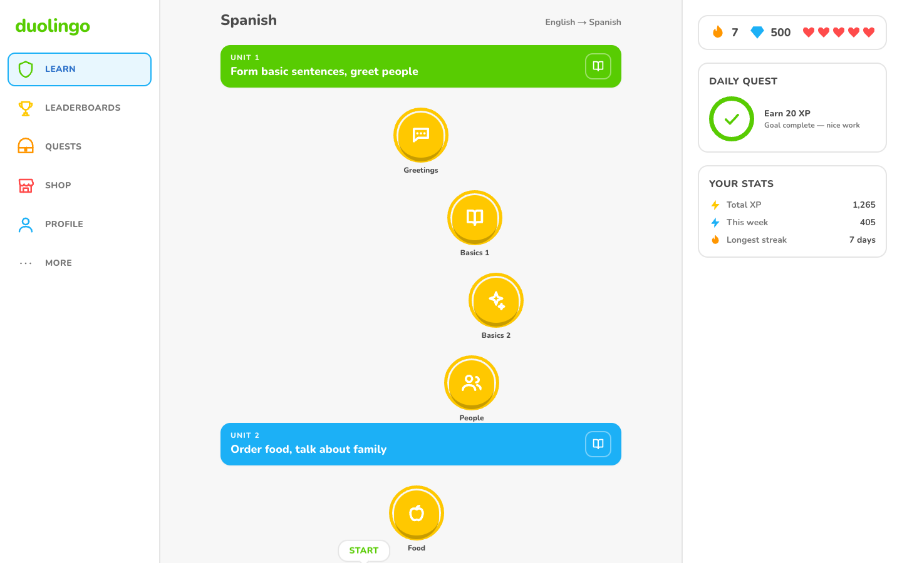
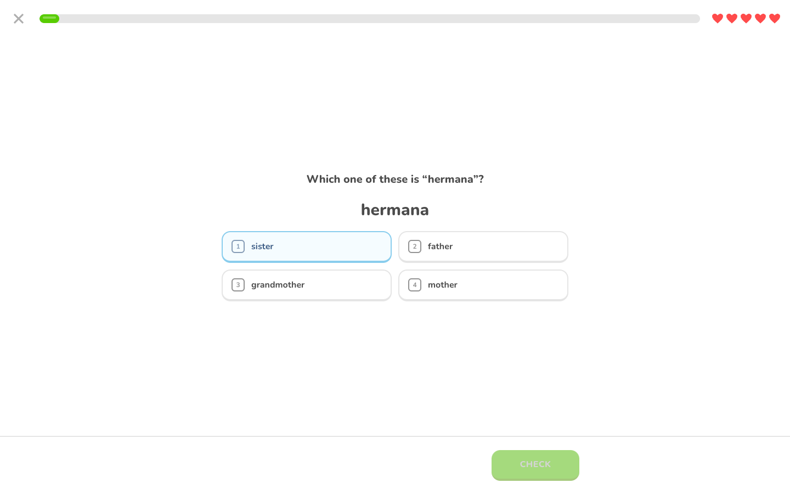
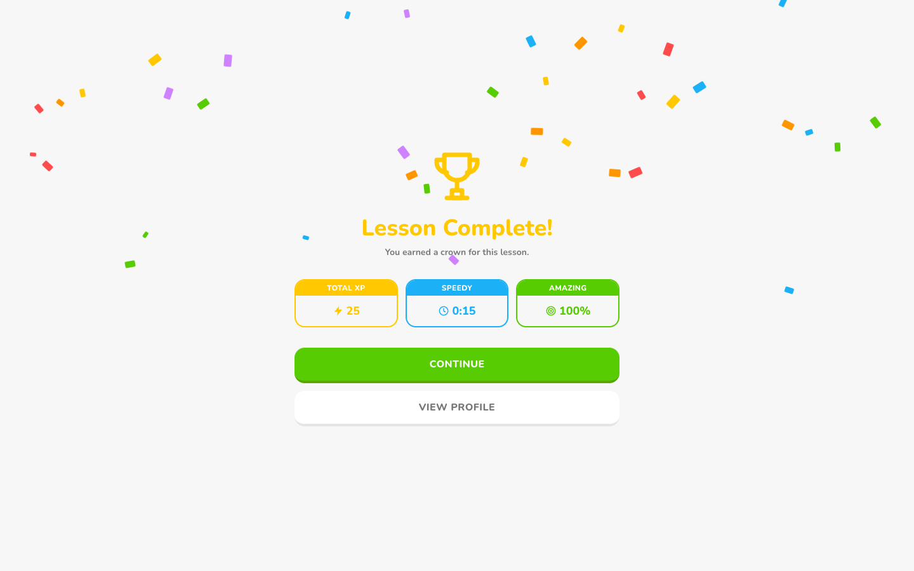
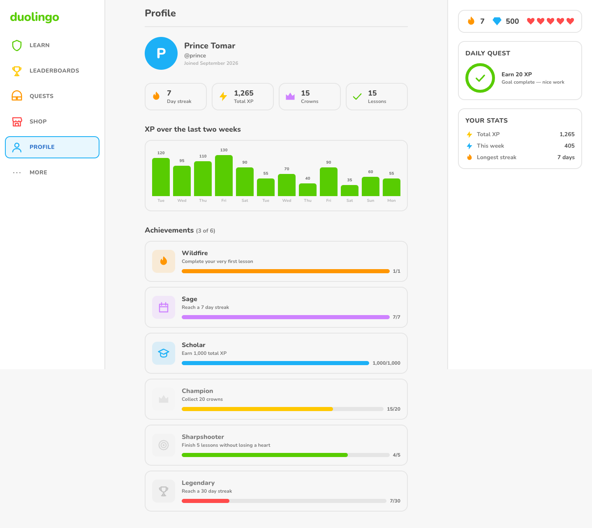
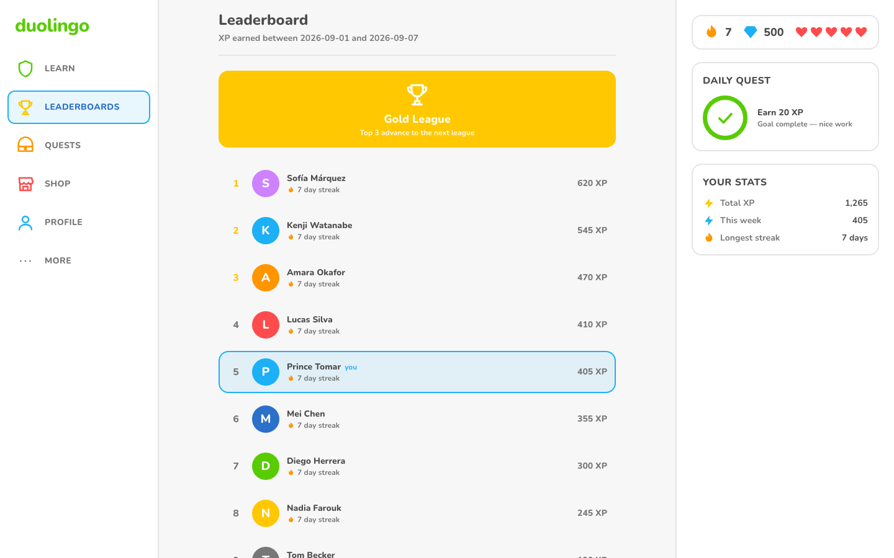
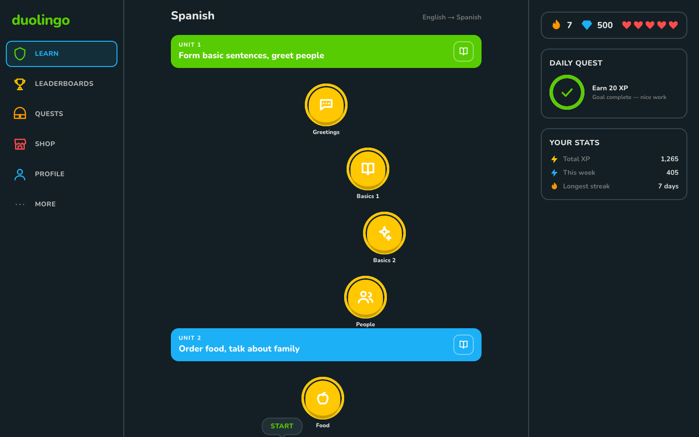
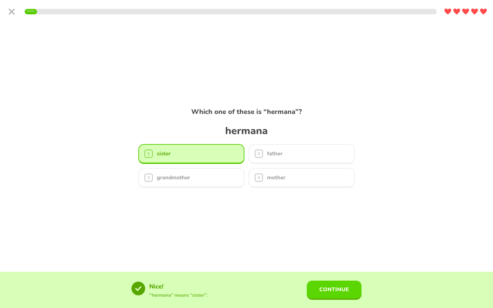
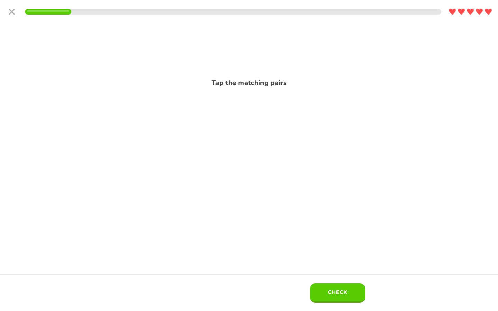
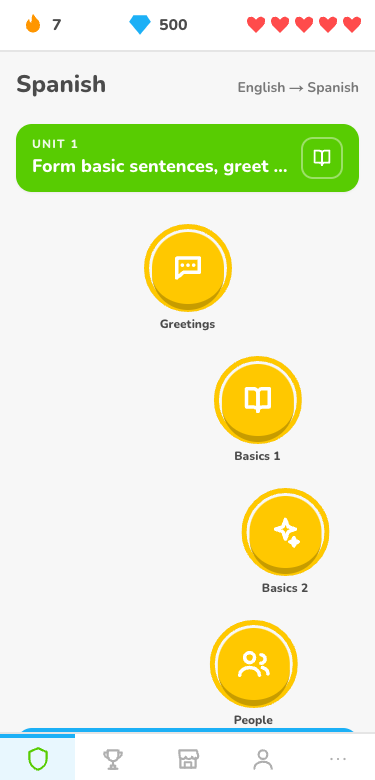
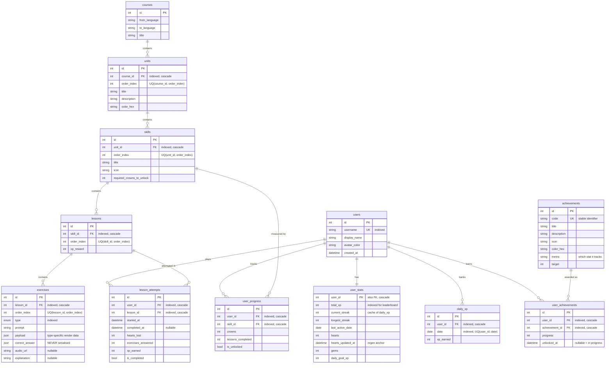

# Duolingo Clone

A working Duolingo clone: a winding skill path, a full-screen lesson player with
five exercise types, and server-authoritative hearts, XP, streaks and crowns.

**Stack:** FastAPI + SQLAlchemy 2.0 + Alembic + SQLite · Next.js 14 App Router +
TypeScript (strict) + Tailwind + Zustand + framer-motion.

The guiding principle throughout: **the client renders, the server decides.** No
answer key, XP formula, heart rule or unlock condition exists in the browser.

---

## Screenshots

| Learn path | Lesson player | Completion |
|---|---|---|
|  |  |  |

| Profile | Leaderboard | Dark mode |
|---|---|---|
|  |  |  |

| Feedback bar | Match pairs | Mobile (375px) |
|---|---|---|
|  |  |  |

Captured from the running app with Playwright at 1440x900 (and 375x780 for
mobile), not mocked.

---

## Quick start

Two terminals, or one `docker compose up --build`.

### Backend

```bash
cd backend
python3 -m venv .venv && source .venv/bin/activate
pip install -r requirements.txt
cp .env.example .env

alembic upgrade head            # create the schema
python -m app.seed.seed_data    # load the course and demo learners (idempotent)
uvicorn app.main:app --reload   # http://127.0.0.1:8000  (docs at /docs)
```

### Frontend

```bash
cd frontend
npm install
cp .env.example .env.local      # NEXT_PUBLIC_API_URL=http://127.0.0.1:8000
npm run dev                     # http://localhost:3000
```

### Docker

```bash
docker compose up --build       # frontend :3000, backend :8000, seeded on boot
```

### Tests

```bash
cd backend && python -m pytest -q      # 118 tests
cd frontend && npm run typecheck && npm run lint
```

---

## Environment variables

| Service | Variable | Default | Purpose |
|---|---|---|---|
| backend | `DEBUG` | `true` | Registers the `/api/v1/dev/*` day-simulation routes. When false they are never mounted. |
| backend | `DATABASE_URL` | `sqlite:///./duolingo.db` | Any SQLAlchemy URL; Postgres works unchanged. |
| backend | `CORS_ORIGINS` | `http://localhost:3000,...` | Comma-separated browser origins. |
| frontend | `NEXT_PUBLIC_API_URL` | `http://127.0.0.1:8000` | Backend base URL. **No localhost is hardcoded in the source.** |

---

## Architecture

```
                    Browser
                       │
   ┌───────────────────┴────────────────────┐
   │  Next.js 14 App Router (frontend/)     │
   │                                        │
   │  app/          routes & pages          │
   │  components/   path · lesson ·         │
   │                exercises · ui · layout │
   │  store/        zustand (session,       │
   │                lesson, theme)          │
   │  lib/api.ts    the ONLY fetch caller   │
   │  types/api.ts  mirrors of the schemas  │
   └───────────────────┬────────────────────┘
                       │  REST /api/v1  (JSON)
   ┌───────────────────┴────────────────────┐
   │  FastAPI (backend/)                    │
   │                                        │
   │  routers/    HTTP only — no logic      │
   │      ↓                                 │
   │  services/   every rule lives here     │
   │      lesson_service      attempts      │
   │      gamification_service hearts/XP/   │
   │                           streaks      │
   │      answer_grader       pure grading  │
   │      path_service        unlock states │
   │      achievement_service badges        │
   │      ↓                                 │
   │  models/     SQLAlchemy 2.0 ORM        │
   │      ↓                                 │
   │  SQLite (Alembic-migrated)             │
   └────────────────────────────────────────┘
```

**The layering rule:** a router may not contain an `if`. It resolves the request,
calls one service, and shapes the result into a Pydantic model. Services raise
domain errors (`NotFoundError`, `SkillLockedError`, `OutOfHeartsError`,
`ConflictError`); a single handler in `main.py` maps each to a status code. That
is the only place status-code policy exists.

---

## Database schema



**Design notes**

- `UNIQUE(parent_id, order_index)` on every content table: two siblings can never
  occupy the same slot on the path.
- Every FK is `ON DELETE CASCADE`, and SQLite's `foreign_keys` pragma is enabled
  per connection in `core/database.py` — without it those cascades silently do
  nothing.
- `user_stats.user_id` is both PK and FK: exactly one stats row per learner,
  enforced by the schema rather than by application code.
- `daily_xp` is the source of truth for streaks; `user_stats.current_streak` is a
  refreshed cache. See the trade-offs section.
- `achievements.metric` makes badge unlocking a data-driven loop instead of an
  `if/elif` over badge codes.

---

## API

All routes are under `/api/v1`. Every response is a Pydantic model; interactive
docs at `/docs`.

| Method | Path | Purpose |
|---|---|---|
| `GET` | `/course/path?user_id=` | Units → skills with per-skill `state` (`locked \| available \| in_progress \| completed`) and crowns, **computed server-side**. |
| `GET` | `/course/skills/{skill_id}/lessons` | Ordered lesson ids, so tapping a node can jump to the next unplayed lesson without downloading every lesson. |
| `GET` | `/lessons/{lesson_id}` | Exercises **without** `correct_answer` or `explanation`. |
| `POST` | `/lessons/{lesson_id}/start` | Opens an attempt. 403 if the skill is locked or hearts are empty. |
| `POST` | `/attempts/{attempt_id}/answer` | Grades one answer server-side → `{is_correct, correct_answer, explanation, hearts_remaining, attempt_failed}`. |
| `POST` | `/attempts/{attempt_id}/match-pair` | Verifies **one** match-pairs link so the board can flash green/red. Costs no heart. |
| `POST` | `/attempts/{attempt_id}/complete` | Awards XP, crowns, streak, unlocks, achievements; returns the completion summary. |
| `GET` | `/users/by-username/{username}` | Bootstraps the demo learner without a hardcoded id. |
| `GET` | `/users/{id}/stats` | Hearts (after lazy regen), streak, gems, today's XP, weekly XP. |
| `GET` | `/users/{id}/profile` | Identity, stats, crowns, badges, 14 days of ledger. |
| `POST` | `/users/{id}/hearts/refill` | Spends 350 gems for a full bar. 409 if full or short. |
| `GET` | `/leaderboard?limit=` | Ranked on the last 7 days of `daily_xp`. |
| `POST` | `/dev/advance-day` | **DEBUG only.** Moves the simulated clock so streak behaviour is provable in seconds. |
| `POST` | `/dev/reset-clock` | **DEBUG only.** Back to real time. |
| `GET` | `/health` | Liveness probe. |

Error responses are uniform: `{"detail": "...", "error": "SkillLockedError"}`.

---

## Gamification rules

All enforced server-side, all unit-tested.

| Rule | Behaviour |
|---|---|
| **Hearts** | Max 5. One lost per wrong answer. At 0 the lesson fails and the out-of-hearts modal appears. |
| **Regeneration** | 1 heart per 30 minutes, computed lazily from `hearts_updated_at` on read. A partially-elapsed interval is banked, not discarded. |
| **XP** | `lesson.xp_reward` (10) + 5 if no hearts were lost + 2 per remaining heart. A flawless run on a full bar pays 25. |
| **Streak** | Derived from `daily_xp`: consecutive days ending today *or yesterday*. Unchanged on a second lesson the same day. Resets when a full day passes with no row. |
| **Crowns** | One per *distinct* lesson completed in a skill. Replaying pays XP but not a second crown. |
| **Unlocking** | A skill opens once the previous skill on the path has its `required_crowns_to_unlock`. |
| **Daily goal** | 20 XP by default; the ring fills from today's ledger row. |
| **Gems** | Mocked currency. 350 buys a full heart bar. |

**Proving the streak rule in the interview:** open Settings → *Advance one day*.
The streak survives one quiet day (the run still ends "yesterday") and collapses
to 0 on the second. Nothing was incremented or decremented — the same
`compute_streak` function simply saw a different `today`.

---

## Seed data

`python -m app.seed.seed_data` — idempotent, safe to re-run.

- 1 course (English → Spanish), **3 units, 12 skills, 29 lessons, 261 exercises**
  using all five exercise types with real Spanish vocabulary.
- Demo learner **`prince`**: Unit 1 complete, mid Unit 2, **1,240 XP**, a **7-day
  streak**, 5 hearts, 500 gems, 14 days of `daily_xp` history summing to exactly
  1,240.
- 9 other learners so the leaderboard has a real field (`prince` places 5th).
- 6 achievements, **3 unlocked** — and unlocked *by the sync service reading the
  seeded state*, not hardcoded.

Content lives in three separate modules: `seed/content.py` (vocabulary and
sentences, pure data), `seed/exercise_factory.py` (deterministic generation of
the five shapes), `seed/seed_data.py` (idempotent upsert). A content edit cannot
break the seeding logic.

---

## Deployment

- **Frontend → Vercel:** `frontend/vercel.json`. Set `NEXT_PUBLIC_API_URL` to the
  deployed backend URL. Note that Next inlines `NEXT_PUBLIC_*` at *build* time,
  so changing it requires a redeploy, not just a restart.
- **Backend → Railway:** `backend/railway.json` + `backend/Procfile`. The start
  command migrates, seeds, then serves. Set `DEBUG=false` and `CORS_ORIGINS` to
  the Vercel domain.
- **SQLite on Railway** needs a mounted volume, or the database is lost on every
  redeploy. Point `DATABASE_URL` at Postgres for anything real — the models and
  migrations need no changes.

---

## Assumptions & trade-offs

Things I decided rather than asked about, and what I traded away.

1. **No authentication.** The assignment is about the learning experience, so
   the "session" is the demo learner resolved by username at boot. Every
   endpoint takes an explicit `user_id`. Adding real auth means a dependency
   that resolves the caller and replaces that parameter — the service layer
   never changes, because no service reads a request.

2. **`daily_xp` ledger instead of a streak counter.** A counter is a number
   nobody can audit: if a bug double-increments it, the damage is permanent and
   invisible. A ledger of days is *evidence* — the streak is recomputed from it
   on every write, a support fix is inserting a row, and the `/dev/advance-day`
   demo works precisely because nothing is stored that could disagree.
   The cost is one extra row per active day per learner and a small recompute on
   completion. `user_stats.current_streak` caches the answer for cheap reads.

3. **Lazy heart regeneration instead of a scheduler.** Storing
   `hearts_updated_at` and deriving hearts on read means no cron, no job queue,
   and correct behaviour after downtime. The trade-off is that hearts only
   "arrive" when someone looks — which is fine, because nothing observes them
   except the learner.

4. **JSON `payload` / `correct_answer` columns.** The five exercise types have
   genuinely different shapes. The alternatives were five sparse tables (joins
   on every lesson fetch) or one wide mostly-NULL table. JSON keeps a lesson a
   single indexed query, and adding a sixth type is a content change plus one
   grader function rather than a migration. What I give up is database-level
   validation of the payload — mitigated by the grader owning every read of it
   and by tests over real generated content.

5. **Skill state is derived, never stored.** Storing `state` would be a second
   source of truth that can drift from the crowns that produced it. `is_unlocked`
   *is* persisted, but only as a denormalised convenience for the lesson-start
   guard; `path_service.build_path` remains the authority and rewrites it.

6. **Unlocking is linear across the whole course**, not per-unit. The spec says
   "the previous skill in the unit"; at a unit boundary that leaves the first
   skill of every unit unlocked from day one. Since the UI draws one continuous
   trail, "the previous skill" is read as the previous skill *on the path*,
   which is the last skill of the previous unit at a boundary. Within a unit the
   behaviour is identical to the spec.

7. **Match-pairs added an endpoint.** The board needs feedback per link, but the
   client must not hold the mapping. `/attempts/{id}/match-pair` answers one
   yes/no per tap — exactly the bit the game reveals anyway — and costs no
   heart, since a board can only be finished by matching everything. This
   matches the real game, where a mis-tap on this exercise is not punished.

8. **Repositories were left out.** The brief allowed "`repositories/` **or** ORM
   models". With five services and no second data source, a repository layer
   would be a pass-through that adds a file per aggregate and hides the query.
   Services use the ORM directly and keep their queries visible.

9. **The simulated clock is process-local and not persisted.** It is a demo aid,
   so a restart must return the app to real time. It also means the offset is
   not shared across workers — irrelevant for a single-process demo, and the
   router is not mounted at all when `DEBUG=false`.

10. **Wrong answers are not re-queued.** The real app re-inserts a failed
    exercise later in the lesson. Not implemented; every exercise is asked once,
    which keeps `exercises_answered` and the accuracy figure exact.

11. **Explicitly mocked, and labelled as such in the UI:** the guidebook button,
    streak freeze and unlimited hearts in the shop, and the weekly quests. Each
    says it is not part of the build rather than pretending to work.

---

## Scaling notes

See `WALKTHROUGH.md` for the full answer. In short: SQLite → Postgres is a URL
change; the path endpoint is already 3 queries regardless of course size; the
leaderboard is the first thing that breaks at scale (a full table scan of
`daily_xp` per request) and would move to a periodically-materialised league
table; `user_stats` is the only hot row per learner, and every write to it is
idempotent enough to sit behind a queue.
